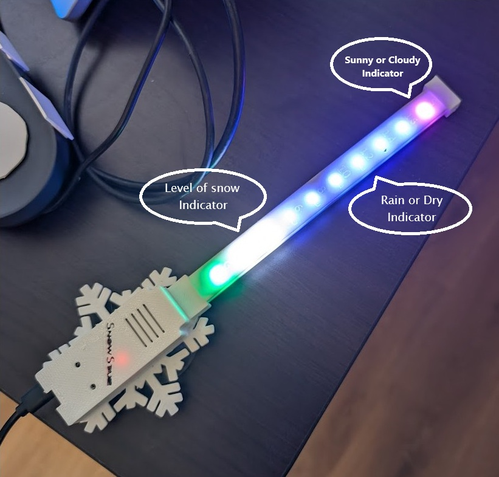

# SnowStake - Remote Ski Resort Snow & Weather Display

## Overview

SnowStake is a DIY project that creates a physical LED indicator device to display **remote snow levels and weather conditions, specifically for a ski resort or chosen location.** This project fetches data from a weather API and visualizes key information using LEDs on a custom device. Originally a side project, it became a hands-on exploration of microcontroller programming, API integration, and remote data visualization.

### Features

- **Remote Snow Depth Display:** Fetches snow depth data from a weather API for a specified ski resort and displays it using a vertical bar of white LEDs.
- **Remote Weather Condition Indicators:** Retrieves weather condition data from an API and indicates conditions using LEDs:

  - **Sunny or Cloudy Indicator (Top LED):** The Top LED illuminates when the API reports sunny conditions for the chosen location, ranges from yellow to black based on visibility.
  - **Rain or Dry Indicator (Blue or Purple LED):** Blue or Purple LED illuminates purple when the API reports rain or wet conditions for the chosen location.

  
  _(Image of the SnowStake device displaying remote weather data)_

- **API Data Driven:** Relies on a weather API (e.g., [Specify API used, if known, e.g., "OpenWeatherMap", "Snow-Forecast.com API"]) to obtain real-time snow and weather information for the target location.
- **Configurable Location:** The code can be configured to fetch data for a specific ski resort or location by setting parameters in the Arduino code (e.g., location coordinates, resort ID, API key).
- **ESP32 Microcontroller:** Powered by the ESP32 for WiFi connectivity to access the weather API and for driving the LED display.
- **Arduino IDE Programmable:** Developed and programmed using the Arduino IDE for ease of customization and modification.
- **Basic Web Interface (Optional):** The `esp32/basic_web` example demonstrates a basic web interface (if implemented) to potentially view the raw API data or device status remotely (Note: This feature may require further development and is example code).

### Hardware Requirements

To build your own SnowStake device, you will need the following hardware components:

- **Microcontroller:** ESP32 Development Board (e.g., ESP32 DevKitC)
- **LEDs:** RGB LED Strip (e.g., NeoPixel or compatible)
- **Wiring:** Jumper wires, breadboard or perfboard for prototyping (or PCB for a more permanent build).
- **Power Supply:** USB cable and power source (e.g., USB power adapter or battery pack)
- **Enclosure (Optional):** Weatherproof enclosure to protect the electronics if deploying outdoors.

### Software Requirements

- **Arduino IDE:** Download and install the Arduino IDE from [https://www.arduino.cc/en/software](https://www.arduino.cc/en/software) (Version [Specify Version if important]).
- **ESP32 Board Support for Arduino IDE:** Follow the instructions to install ESP32 board support: [Link to ESP32 Arduino Core Installation Instructions]\[Replace with a link to official ESP32 Arduino core installation guide]
- **Arduino Libraries:** Install the following libraries using the Arduino Library Manager (Sketch > Include Library > Manage Libraries...):

### Installation and Setup Instructions

1. **Hardware Wiring:**

   - Connect the LEDs to the ESP32 according to your chosen LED configuration and wiring. (Optional: Add a basic wiring diagram if helpful).
   - Connect the power supply to the ESP32.

2. **Install ESP32 Board Support and Libraries:**

   - Follow the instructions in the "Software Requirements" section to install the ESP32 board support and libraries in the Arduino IDE.

3. **Open the Arduino Sketch:**

   - In the Arduino IDE, open the `esp32/basic_web/basic_web.ino` file (or your main `.ino` file).

4. **Configure Weather API and Location:**

   - **API Key:** Obtain an API key from your chosen weather API provider (e.g., OpenWeatherMap).
   - **Location Settings:** Modify the code to include your API key and the location details (e.g., latitude/longitude coordinates, ski resort name/ID) for the ski resort data you want to display. _(Provide specific instructions, e.g., "Look for the `const char_ apiKey = "YOUR_API_KEY";`and`const String location = "SkiResortName";` lines and replace the placeholders.")\*

5. **Select Board and Port:**

   - In the Arduino IDE, go to "Tools > Board" and select your ESP32 development board.
   - Connect your ESP32 board to your computer via USB.
   - Select the correct port for your ESP32 board in "Tools > Port".

6. **Upload the Code:**
   - Click the "Upload" button in the Arduino IDE to compile and upload the code to your ESP32 board.

### Usage Instructions

1. **Power On the SnowStake:** Connect the USB power supply to your SnowStake device.
2. **Observe LED Indicators:** After connecting to WiFi (if applicable) and fetching data from the API, the LEDs will display:
   - **Snow Level:** The white LEDs will represent the snow depth at the configured ski resort, as reported by the weather API.
   - **Sunny/Cloudy:** The top LED will indicate sunny/cloudy conditions at the ski resort based on API data.
   - **Rain/Dry:** The LEDs between the top and white will indicate rain/dry conditions at the ski resort based on API data.

### Contributing

Contributions to the SnowStake project are welcome!

### License

This project is licensed under the MIT License - see the [LICENSE](LICENSE) file for details.
